<p align="center">
  
</p>

<p align="center">
<pre>
███████╗███████╗ ██████╗  ██████╗██╗███████╗████████╗██╗   ██╗
██╔════╝██╔════╝██╔═══██╗██╔════╝██║██╔════╝╚══██╔══╝╚██╗ ██╔╝
█████╗  ███████╗██║   ██║██║     ██║█████╗     ██║    ╚████╔╝ 
██╔══╝  ╚════██║██║   ██║██║     ██║██╔══╝     ██║     ╚██╔╝  
██║     ███████║╚██████╔╝╚██████╗██║███████╗   ██║      ██║   
╚═╝     ╚══════╝ ╚═════╝  ╚═════╝╚═╝╚══════╝   ╚═╝      ╚═╝   
</pre>
</p>

<div align="center">

# <samp>Fsociety00_alderson_core.dat</samp>

**<samp>The Central Nervous System | Advanced Red Team Weaponized Arsenal</samp>**

<br>

<samp>Architect: <a href="https://github.com/fsoc-ghost-0x">C0deGhost</a> | Version: 1.1.0 (Evolution) | Status: <font color="#ff4500">ENCRYPTED</font></samp>

</div>

<div align="center">


</div>

---

<details>
<summary><code>Accessing Alderson Core Directory...</code></summary>

- [▌ 0x01_MISSION_LOGS](#-0x01_mission_logs)
- [▌ 0x02_ARSENAL_STRUCTURE](#-0x02_arsenal_structure)
- [▌ 0x03_CORE_COMPONENTS](#-0x03_core_components)
- [▌ 0x04_DEPLOYMENT_PROTOCOL](#-0x04_deployment_protocol)
- [▌ 0x05_LEGAL_DISCLAIMER](#-0x05_legal_disclaimer)

</details>

<br>

## <samp>▌ <u>0x01_MISSION_LOGS</u></samp>

<details open>
  <summary><code>Decrypting Intel...</code></summary>
  
  ### <samp>The Purpose</samp>

  <samp>
  Most people are a delusion. They live in a world that doesn't exist. This repository is the reality check. 
  
  <code>Fsociety00_alderson_core.dat</code> is a curated collection of weaponized logic. It contains the tools necessary to dismantle infrastructures, escalate through the shadows, and maintain a ghost-like presence in any environment. 
  </samp>

  ### <samp>Operational Doctrine</samp>
  
  **<samp>1. Silence is Power:</samp>** <samp>Designed to minimize telemetry and bypass EDR/AV detection.</samp>
  **<samp>2. Adaptation is Survival:</samp>** <samp>From web-facing vulnerabilities to low-level kernel exploits.</samp>
  **<samp>3. Control is an Illusion:</samp>** <samp>We don't ask for permission; we take the root.</samp>
  
  <div align="center">
    <br>
    <i><font color="#888888" face="monospace">"Hello, friend. Let's talk about the world they built for you."</font></i>
  </div>

</details>

<br>

## <samp>▌ <u>0x02_ARSENAL_STRUCTURE</u></samp>

<samp>The matrix of the repository is organized into deterministic sub-sectors for surgical access:</samp>



<br>

## <samp>▌ <u>0x03_CORE_COMPONENTS</u></samp>

| <samp>Sector</samp> | <samp>Category</samp> | <samp>Description</samp> |

```mermaid
graph TD;
    Root["fsociety00_alderson_core.dat"] --> A["0x01_Exploits_Custom"];
    Root --> B["0x02_LPE_Vectors"];
    Root --> C["0x03_Tools_PostEx"];
    Root --> D["0x04_Automated_Scripts"];
    Root --> E["0x05_CVE_Weaponized"];
    Root --> F["0x06_Reverse_Shells"];
    Root --> G["0x07_Backdoors_Persistence"];
    Root --> H["0x08_Windows_Sector"];
    Root --> I["0x09_Linux_Sector"];
    Root --> J["0x10_LowLevel_Kernel"];
    Root --> K["0x11_Web_Hacking"];

    style Root fill:#111,stroke:#ff4500,stroke-width:2px,color:#ff4500
    style H fill:#222,stroke:#00adef,stroke-width:2px,color:#00adef
    style I fill:#222,stroke:#f5ba14,stroke-width:2px,color:#f5ba14
```

| :--- | :--- | :--- |
| <samp><code>/exploits</code></samp> | <samp>Custom & Weaponized</samp> | <samp>Polymorphic exploits and personalized PoCs.</samp> |
| <samp><code>/LPE</code></samp> | <samp>Privilege Escalation</samp> | <samp>Local vectors to transition from user to #root / SYSTEM.</samp> |
| <samp><code>/windows</code></samp> | <samp>Win-Offensive</samp> | <samp>Vulnerabilities, AD Exploits, GPO Abuse, and C#/.ps1 Scripts.</samp> |
| <samp><code>/linux</code></samp> | <samp>Linux-Offensive</samp> | <samp>Kernel exploits, GTFOBins, SUID abuse, and Bash automation.</samp> |
| <samp><code>/tools</code></samp> | <samp>Post-Exploitation</samp> | <samp>Binaries for pivoting, exfiltration, and recon.</samp> |
| <samp><code>/automation</code></samp> | <samp>Surgical Scripts</samp> | <samp>Python and Bash scripts for rapid deployment.</samp> |
| <samp><code>/CVEs</code></samp> | <samp>Vulnerability Archive</samp> | <samp>Documented and ready-to-fire CVE implementations.</samp> |
| <samp><code>/shells</code></samp> | <samp>Reverse & Bind</samp> | <samp>Encrypted tunnels and stealthy callback mechanisms.</samp> |
| <samp><code>/low-level</code></samp> | <samp>Kernel & Memory</samp> | <samp>Buffer overflows, heap sprays, and kernel-land attacks.</samp> |
| <samp><code>/web</code></samp> | <samp>Application Security</samp> | <samp>Advanced SQLi, LFI/RFI, and logic flaw weaponization.</samp> |

<br>

## <samp>▌ <u>0x04_DEPLOYMENT_PROTOCOL</u></samp>

<details>
  <summary><code>View Initialization Sequence...</code></summary>
  
  ### <samp>1. Cloning the Core</samp>
  ```bash
  git clone https://github.com/fsoc-ghost-0x/fsociety00_alderson_core.dat.git
  cd fsociety00_alderson_core.dat
  ```

  ### <samp>2. Initializing Environment</samp>
  <samp>Ensure all dependencies are isolated in a virtual environment.</samp>
  
  ```bash
  python3 -m venv .vault
  source .vault/bin/activate
  pip install -r requirements.txt
  ```
  
</details>

<br>

## <samp>▌ <u>0x05_LEGAL_DISCLAIMER</u></samp>
<samp>
This repository is intended for authorized penetration testing and educational purposes only. Unauthorized access to computer systems is illegal. The creator is not responsible for what you do with the power contained here.
</samp>
<br>
<i><font color="#888888" face="monospace">"Control is an illusion."</font></i>

---

<p align="center">
  <samp><strong><font color="#ff4500">WE ARE FSOCIETY. WE ARE FINALLY FREE. WE ARE FINALLY AWAKE.</font></strong></samp>
</p>
